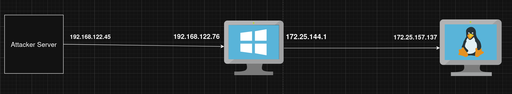

---

title: autoroute (ligolo-ng)
description: orsted c2 autoroute
---

### General

The `autoroute` command is available in all orsted C2 menu.

This functionality was born because I personally dislike socks.

It allows to implement the famous `ligolo-ng` natively through `orsted-beacon` or a chain of `orsted-beacon`.

```
orsted-client » autoroute --help

Command related to ligolo routing

Usage:
  autoroute [flags]

Flags:
  -h, --help     display help

Sub Commands:
  add     Add route
  delete  delete route subnet. If route subnet becomes empty, delete route o the fly.
  list    list route
```

Imagine you have the following usecase:



You have an `orsted-beacon` on the windows machine. You want to ping the linux one.

### Autoroute Add

You can add an autoroute by giving the subnet and the `orsted-beacon` ID. If everything goes well, `orsted-server` will create the `tun` interface.

For example, for the usecase above, you can

```bash
orsted-client » autoroute add 8 172.25.144.0/20
```

where:

- `8` is the Session ID of the beacon on windows
- `172.25.144.0/20` is the subnet for routing (contains `172.25.157.137`)

On `orsted-server` (not the `orsted-client`) you can then ping, open UDP/TCP sockets with `172.25.157.137`

```
┌──[parrot@parrot]─[~]
└──╼ $ ping 172.25.157.137
PING 172.25.157.137 (172.25.157.137) 56(84) bytes of data.
64 bytes from 172.25.157.137: icmp_seq=1 ttl=64 time=135 ms
64 bytes from 172.25.157.137: icmp_seq=2 ttl=64 time=107 ms
64 bytes from 172.25.157.137: icmp_seq=3 ttl=64 time=129 ms
```

This functionality works on a chain of `orsted-beacon` too, regardless of the OS or the transport Type.

You can add multiple subnet on the same `orsted-beacon`.

For example and if you are familiar with `ligolo-ng` you know that this is usefull ;)

```bash
orsted-client » autoroute add 8 240.0.0.1/32
```


### Autoroute List

You can list all the autoroute used

```bash
orsted-client » autoroute list
```

The result will be something like

```
orsted-client » autoroute list
+----------+-----------+-------------------------------+
| ROUTE ID | BEACON ID |            SUBNET             |
+----------+-----------+-------------------------------+
|        1 |         8 | 172.25.144.0/20, 240.0.0.1/32 |
+----------+-----------+-------------------------------+
```


### Autoroute delete

You can delete an autoroute by giving the Beacon ID (and not Route ID) as well as the subnet

```bash
orsted-client » autoroute delete 8 172.25.144.0/20
```

If the subnet is empty for a specific route, the `tun` will be deleted, you may need to wait 1 min to be able to ligolo again.
