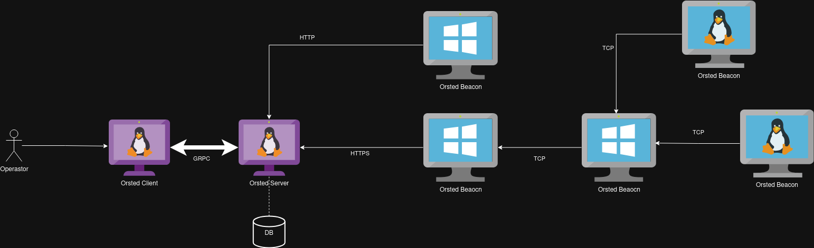

### Why did I choose Go for this ?

I enjoy writing Go.


### Components

Orsted components are pretty straight forward.

- `orsted-server` is the central server of the Framework
- `orsted-db` is the database (file) that store and track what is done
- `orsted-client` is the CLI that allow the operator to interact with the `orsted-server`
- `orsted-beacon` is the piece of software delivered to a victim

Here is a small diagram showcasing the components talking with each others.



### Project and Directory structure

```
.
├── beacon
├── client
├── data
│   └── clientconf.toml
├── modules
│   ├── cat
│   ├── download
│   ├── evasion
│   ├── execute-assembly
│   ├── inline-clr
│   ├── ls
│   ├── powercliff
│   ├── procdump
│   ├── ps
│   ├── psexec
│   ├── run
│   ├── runas
│   ├── shell
│   └── token
├── profiles
├── protobuf
├── server
├── test
└── tools
    ├── compiled-modules
    │   ├── linux
    │   └── windows
    └── windows
        ├── dotnet
        └── ps1
```
